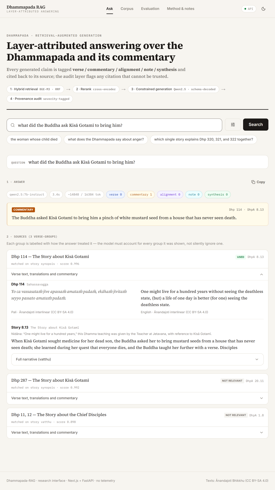
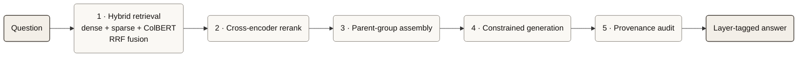
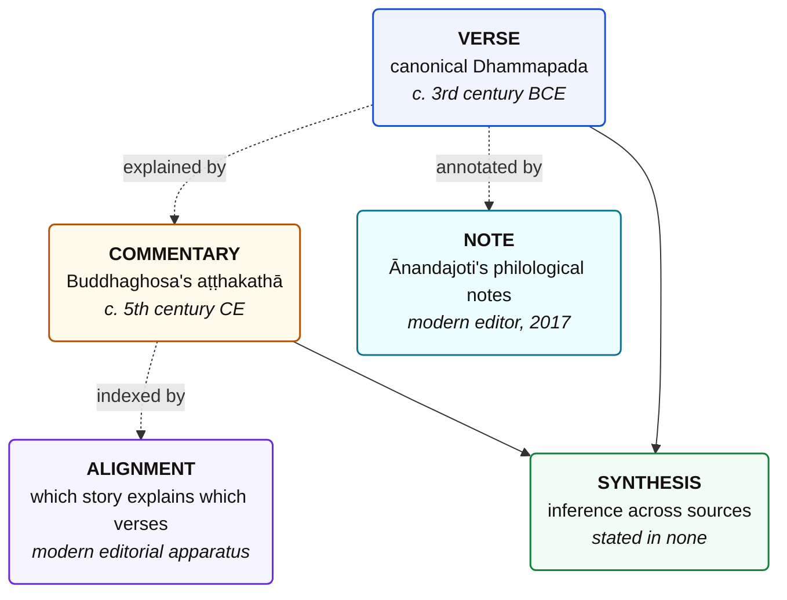
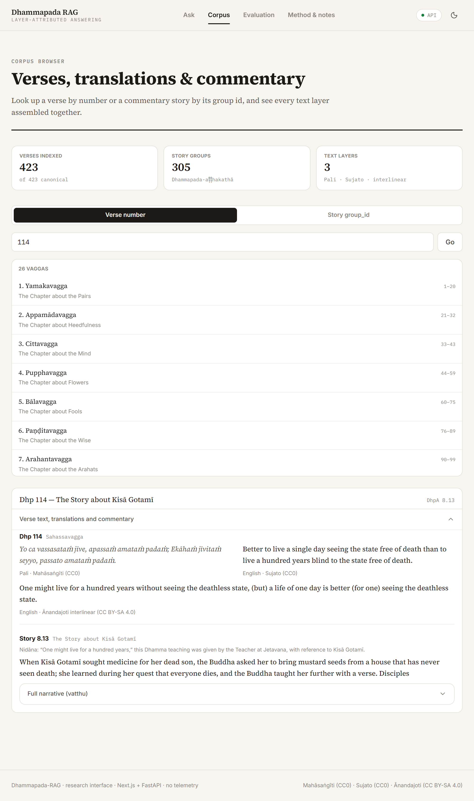
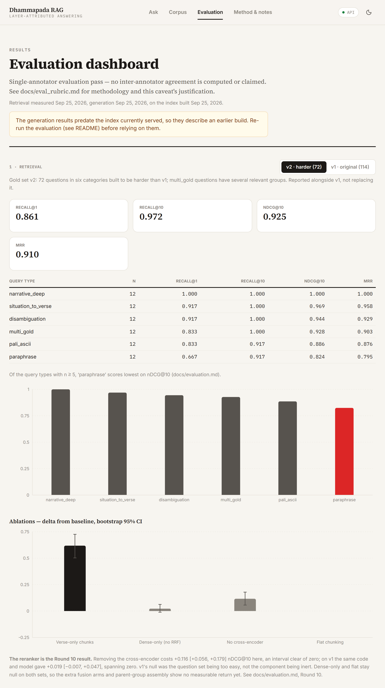

<div align="center">

# Dhammapada RAG

**Retrieval-augmented answering that keeps the verse, the commentary, and the editorial apparatus as separately attributed layers.**

[](LICENSE)
[](DATA_LICENSE.md)
[](pyproject.toml)
[](tests/)
[](docs/datasheet.md)

</div>

---

Ask a question about the Dhammapada and most systems answer in one voice. But the
answer to *"what did the Buddha ask Kisā Gotamī to bring him?"* is not in the
Dhammapada. The mustard seed is Buddhaghosa's, written eight centuries after the
verse it explains. A system that does not mark that difference is not summarising
the text — it is quietly rewriting it.

This project keeps five kinds of statement apart, tags every generated claim with
which kind it is, and refuses to emit a citation it cannot resolve against
something actually retrieved.



## Findings

The engineering is in the repository. These are the things it turned up.

### A default silently deleted the commentary layer

Ollama defaults `num_ctx` to 2048 tokens. The prompt carried three full
commentarial narratives. The commentary was truncated away before the model saw
it — so every answer came back tagged `verse`, and **nothing in the pipeline
reported a problem**: the index built cleanly, retrieval returned results,
generation produced schema-valid cited output.

A second, independent truncation compounded it. `chunks.py` emitted each
narrative as one chunk; `embed.py` encoded at `max_length=512`. Roughly 84% of
all narrative text was never embedded and was unretrievable at any *k*.

Both bugs produced output that looked entirely correct. The repository now
raises rather than truncates in both places, and
[`test_source_snapshot.py`](tests/test_source_snapshot.py) fails if the pinned
source files drift from their recorded checksums.

### Prompting fails for structural behaviour; grammar constraints do not

Three interventions, escalating, with measured effect:

| Intervention | Kind | Result |
|---|---|---|
| Prompt instruction | declarative | **Negligible** — told to "explicitly dismiss irrelevant sources", the model dismissed none in 27 answers |
| Context **layout** | structural, in-context | **Substantial** — giving the alignment layer its own prompt block raised its recall 0.50 → 0.78 |
| **Schema** constraint | grammar-level | **Absolute** — citation fields as per-request enums; four classes of citation error became unrepresentable, and source disposition went 0/27 → 27/27 |

Telling a model a taxonomy has weak effect. Arranging the context to mirror the
taxonomy has moderate effect. Encoding it in the decoding grammar is
deterministic. This generalises to any RAG system where provenance matters.

### A saturated gold set cannot see its own components

Gold set v1 (114 scored questions) reported baseline Recall@10 = 0.983. Two of
four ablations returned confidence intervals spanning zero and a third's lower
bound sat at exactly zero — the cross-encoder reranker looked useless.

Gold set v2 (72 deliberately harder questions) was built and the same ablations
re-run on the same code. The reranker's effect grew sixfold, to +0.116
[+0.056, +0.179], and crossed significance. It was always working; v1 simply
could not measure it.

Current numbers, after the October 2026 change to the verse layer (see
[Corpus](#corpus)):

| Ablation | v1 Δ nDCG@10 [95% CI] | v2 Δ nDCG@10 [95% CI] |
|---|---|---|
| `verse_only` (no commentary chunks) | +0.436 [+0.346, +0.531] ✱ | +0.608 [+0.492, +0.715] ✱ |
| `no_rerank` (no cross-encoder) | **+0.051 [+0.015, +0.086] ✱** | **+0.114 [+0.054, +0.176] ✱** |
| `dense_only` (no sparse/ColBERT/RRF) | +0.001 [−0.009, +0.013] | +0.023 [−0.005, +0.058] |
| `flat` (no parent-group assembly) | +0.003 [+0.000, +0.008] | +0.003 [+0.000, +0.008] |

<sub>✱ interval excludes zero. Both runs: same index, same code, RTX 5080.</sub>

v1 now detects the reranker too, entirely through its doctrinal questions.
Those were written in the vocabulary of the translation the index no longer
holds, so first-stage retrieval ranks them lower and the cross-encoder
recovers them. **`dense_only` and `flat` remain null on both sets** — sparse
and ColBERT add nothing over dense alone, and parent-group assembly barely
moves the ranking. Reported as null results rather than omitted, and they
argue that fusion beyond dense, and the assembly step, are complexity without
a measurable retrieval-quality return.

### Commentary retrieval does not help verse-anchored questions

The architectural claim, tested where it can fail. Removing commentary chunks
destroys narrative and alignment queries — but that is near-tautological, since
their gold answer lives in the commentary. The informative cell is doctrinal:

| Query type | baseline | verse_only | Δ |
|---|---|---|---|
| narrative | 0.975 | 0.096 | +0.879 |
| alignment | 1.000 | 0.000 | +1.000 |
| philological | 0.963 | 0.919 | +0.044 |
| **doctrinal** | **0.859** | **0.881** | **−0.022** |

Verse-only *beats* the full system on doctrinal queries. It did on the original
corpus (0.988 against 0.942, reproduced on separate hardware), and still does
after the verse layer changed. Commentary retrieval does not help
verse-anchored questions and may slightly hurt them.

### Correct citations, false content

Six documented cases where a claim carried the right layer tag, a resolvable
citation, and traceable provenance — and was wrong. The clearest:

> Kisā Gotamī found no mustard seed *"because no household had ever seen a
> death."*

The commentary's point is the exact reverse: **every** household had. Structural
provenance checking cannot reach this class of error, which is why the rubric
now scores source fidelity separately from layer attribution. Two recurring
subtypes are named and tracked: *semantic-neighbour conflation* (details
migrating between narratives that share a structural role) and *scope widening*
(a verse's "best of paths" becoming "the best thing in life").

---

## How it works



Retrieval matches on the **tightest** unit — one verse, one pāda gloss, one
window of narrative — then returns the **whole** verse-group, so the reader
always sees every layer regardless of which one matched.

### The five layers



`alignment` exists because *"story 1.3 explains Dhp 3–4"* is true of neither the
verse nor the commentary — it is a modern editorial fact, and filing it under
`commentary` attributes to Buddhaghosa a claim he never made. `note` exists for
the same reason: an editor's gloss on a word ("what is not made is Nibbāna") is
neither the verse nor Buddhaghosa, and tagging it as either misattributes it.

The answer schema has **no free-text summary field**, deliberately: an untagged
paragraph is the escape hatch a conflated claim slips through. Readable prose is
composed client-side from tagged claims, so *"The verse states…"* and *"The
commentary relates…"* survive being copied out.

---

## Corpus

| Layer | Source | Licence |
|---|---|---|
| Pali verse | Ānandajoti Bhikkhu, 2017 interlinear | CC BY-SA 4.0 |
| English verse | Ānandajoti Bhikkhu, 2017 interlinear | CC BY-SA 4.0 |
| Interlinear gloss + notes | Ānandajoti Bhikkhu, 2017 | CC BY-SA 4.0 |
| Commentary, titles, verse grouping | Ānandajoti's revision of Burlingame, 2024 | CC BY-SA 4.0 |

**423** verses · **26** vaggas · **305** commentarial stories · **5,494**
indexed chunks. Full coverage, no gaps, validated on every build.

Until October 2026 the verse layer also used the Mahāsaṅgīti Pali and Bhikkhu
Sujato's English translation, both published by SuttaCentral. SuttaCentral
[asked](https://discourse.suttacentral.net/t/licensing-question-retrieval-over-cc0-texts-does-this-fall-under-your-ai-request/45514)
that their material not be used in any project that uses AI, so both were
removed from the corpus and from the repository's history (the decision, and
the one thing the history purge did not reach, are recorded in
[`data/raw/PROVENANCE.md`](data/raw/PROVENANCE.md)).

Use of the Ānandajoti editions is by written permission
([`sources/PERMISSION.md`](sources/PERMISSION.md)). Share-alike propagates:
derived data files are CC BY-SA 4.0, the code is MIT, stated per file in
[`DATA_LICENSE.md`](DATA_LICENSE.md).

The Ānandajoti sources are **pinned by SHA-256**
([`sources/SHA256SUMS`](sources/SHA256SUMS),
[`data/raw/PROVENANCE.md`](data/raw/PROVENANCE.md)) because the upstream editor
corrects files when he finds mistakes — without a pin, a future discrepancy
could not be told apart from our own parsing error. `sources/fetch.sh --verify`
checks the pin; a test fails if it drifts.



---

## Quick start

```bash
git clone https://github.com/mihinbuilds/dhammapada-rag.git
cd dhammapada-rag
python -m venv .venv && source .venv/bin/activate    # Windows: .venv\Scripts\Activate.ps1
pip install -e .

python src/dhammapada_rag/index/embed.py             # first run downloads BGE-M3 (~2.3 GB)
```

Then, in two terminals:

```bash
uvicorn dhammapada_rag.api.main:app --app-dir src --port 8000
cd web && npm install && npm run dev                 # http://localhost:3000
```

Generated answers additionally need [Ollama](https://ollama.com):
`ollama pull qwen2.5:7b-instruct && ollama serve`. Without it, retrieval-only
mode works and the UI falls back to it.

<details>
<summary><b>Windows note</b></summary>

Set `PYTHONUTF8=1` (`setx PYTHONUTF8 1`) — the default cp1252 codepage cannot
print Pali diacritics and crashes rather than degrading.
</details>

<details>
<summary><b>No frontend needed</b></summary>

The API is fully usable alone: `http://127.0.0.1:8000/docs` is an interactive
interface, and the CLI works with nothing running —
`python src/dhammapada_rag/index/assemble.py "the woman whose child died"`.
</details>

---

## Evaluation

Everything is reproducible from the command line; the dashboard only reads the
JSON these produce.

```bash
python -m dhammapada_rag.eval.retrieval_eval --gold data/eval/gold_set_v2.jsonl \
                                             --out  data/eval/retrieval_results_v2.jsonl
python -m dhammapada_rag.eval.aggregate_retrieval --results data/eval/retrieval_results_v2.jsonl \
                                                  --out     data/eval/retrieval_metrics_v2.json
```

Two gold sets, both committed: **v1** (120 questions, 6 types; 114 scored, as 6
have no gold answer) and **v2** (72 harder questions across `narrative_deep`,
`paraphrase`, `pali_ascii`, `disambiguation`, `multi_gold`,
`situation_to_verse`). Ablations are single-factor — every condition except
`no_rerank` reranks, so a delta is attributable to one component.



### Limitations, stated plainly

- **Evaluation is single-annotator.** No inter-annotator agreement statistic
  exists. A blind 30-question sheet, a κ script and an annotator brief are
  ready ([`docs/annotator_brief.md`](docs/annotator_brief.md)); a second reader
  has not yet run them. Calibration point: on that sheet, 10% randomly flipped
  labels gives κ ≈ 0.685 (0.645–0.710 over five seeds), so whatever number
  comes back can be read against something concrete rather than a textbook
  threshold.
- **Story grouping has one witness.** Ānandajoti's 2024 numbering is the only
  source for which verses each story explains. A systematic misalignment in that
  edition would not be detectable here.
- **Gold sets are constructed from known answers**, not sampled from real user
  queries.
- **Two of four retrieval components show no measurable effect** — see the
  ablation table above.
- **Generation numbers move with prompt wording.** Rewording the system prompt
  without changing its meaning moves layer accuracy by up to 0.08 and source
  fidelity by up to 0.09 on the 27-question sample (repeat runs at a fixed
  prompt are near-identical). Single-run differences smaller than that are
  not evidence of anything; see `docs/evaluation.md`, Round 15.

---

## Repository

```
src/dhammapada_rag/
  ingest/     corpus construction: PDF/HTML → data/processed/
  index/      chunking, BGE-M3 embedding, hybrid search, rerank, assembly
  generate/   schema, prompt, constrained generation, provenance audit, rendering
  api/        FastAPI service
  eval/       retrieval + generation metrics, ablations, model sweep, κ tooling
web/          Next.js frontend (Ask · Corpus · Evaluation · Method)
data/         processed corpus, chunk index, gold sets, evaluation results
docs/         datasheet, corpus audit, evaluation, rubric, annotator brief
```

Full development history, including the bugs above and what they superseded:
[`docs/evaluation.md`](docs/evaluation.md), with the pre-fix baseline preserved
at `docs/evaluation_pre_fix.md`.

---

## Citation

```bibtex
@software{dhammapada_rag_2026,
  title  = {Dhammapada-RAG: Layer-Attributed Retrieval-Augmented Generation
            over the Dhammapada and its Commentary},
  author = {Mihindupura, Sujeewa},
  year   = {2026},
  url    = {https://github.com/mihinbuilds/dhammapada-rag}
}
```

## Acknowledgements

**Ānandajoti Bhikkhu**, for the editions this project depends on and for
permission to build on them. **E. W. Burlingame**, whose 1921 *Buddhist
Legends* underlies the commentary translation.
